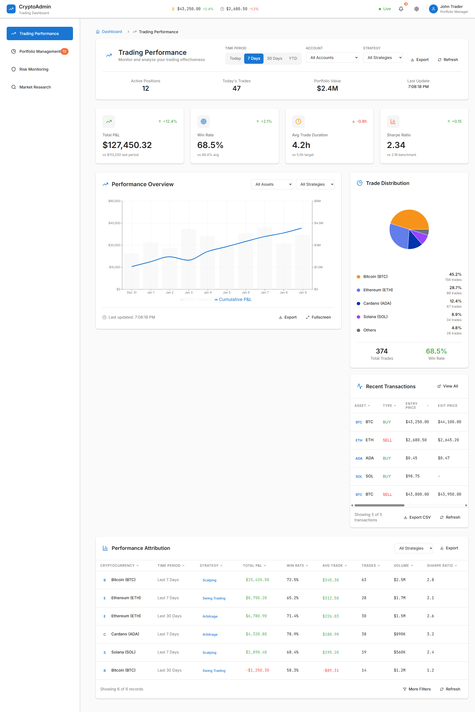

# 🧠 CryptoAdmin Dashboard


---

```markdown


A modern, responsive, real-time cryptocurrency intelligence dashboard built with React 18, Vite, Redux Toolkit, TailwindCSS, Recharts, and D3.js. This project provides a modular and scalable platform to visualize crypto market performance, analyze technical indicators, and track real-time activity — all in a developer-friendly and visually polished environment.



---

## 🚀 Features

- 📊 **Real-Time Charting:** BTC/USD chart with candlestick, line, and area types using Recharts + D3.
- 🧮 **Technical Indicators:** Toggle MA20, MA50, RSI, and MACD overlays.
- 📈 **Market Metrics Cards:** Animated summary cards with sparklines and real-time deltas.
- ⏱ **Live Price Ticker:** Top gainers, losers, volume leaders, and watchlist integration.
- 🛠 **Global Controls:** Time range, auto-refresh intervals, and exchange filter support.
- 📱 **Responsive Layout:** Fluid dashboard experience across devices using Tailwind Grid and container queries.
- 🎨 **Dark/Light Mode:** Tailwind dark mode ready with animation and transition polish.
- 🧪 **Test Ready:** Includes Jest and React Testing Library setup.

---

## 🛠 Tech Stack

| Layer        | Tech                                                                 |
|--------------|----------------------------------------------------------------------|
| Frontend     | React 18, Vite, TailwindCSS, Redux Toolkit, Framer Motion            |
| Visualization| D3.js, Recharts                                                      |
| Forms        | React Hook Form                                                      |
| UI Enhancers | @radix-ui/react-slot, Tailwind plugins (forms, animate, fluid-type) |
| State        | Redux, Redux Toolkit                                                 |
| Routing      | React Router v6                                                      |
| Icons        | Lucide-react                                                         |
| Tooling      | ESLint, Prettier, dotenv                                             |

---

## 📁 Folder Structure

```

src/
├── components/          # Reusable shared components
├── pages/
│   ├── market-overview-dashboard/
│   │   ├── components/  # Local widgets (Chart, Ticker, Metrics)
│   │   └── index.jsx    # Main dashboard page
├── styles/              # Tailwind + global CSS
├── App.jsx              # Root component
├── index.jsx            # Entry point (renders App)
└── Routes.jsx           # Application routing

````

---

## 🧰 Getting Started

### 1. Clone the Repo

```bash
git clone https://github.com/russell-henderson/cryptoadmin_dashboard.git
cd cryptoadmin_dashboard
````

### 2. Install Dependencies

```bash
npm install
```

### 3. Start the Dev Server

```bash
npm run dev
```

Your dashboard will run locally at:
`http://localhost:5173/`

---

## 🧪 Testing

```bash
npm run test
```

Uses:

* Jest
* @testing-library/react
* @testing-library/user-event

---

## 📦 Build for Production

```bash
npm run build
```

Static files will be output to `dist/`.

---

## 🤝 Contributing

1. Fork the repository
2. Create a feature branch: `git checkout -b feature/your-feature-name`
3. Commit your changes: `git commit -m "feat: add X"`
4. Push to your branch: `git push origin feature/your-feature-name`
5. Create a Pull Request on GitHub

All code should follow:

* Tailwind utility-first styling
* Functional components and hooks
* Prettier formatting

---

## 🧠 Roadmap

* [ ] Exchange selector with real data APIs
* [ ] Customizable chart presets
* [ ] Websocket-powered price feeds
* [ ] Theming system with saved preferences
* [ ] Account login & user-defined watchlists

---

## 📄 License

MIT © [Russell Henderson](https://github.com/russell-henderson)

---

## 🌐 Live Demo

Coming soon — hosted on Vercel or Netlify.

```

---

Would you like me to:
- Push this `README.md` to your project’s `main` branch?
- Generate a version with collapsible sections (e.g. `<details>` for advanced devs)?

Let me know how you want to publish or tweak this.
```
